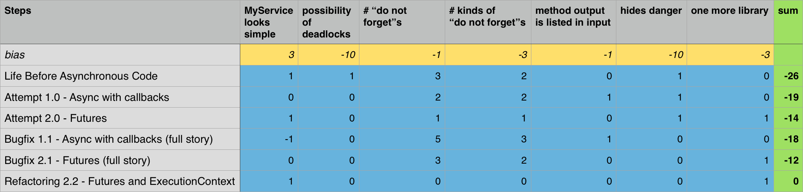

# Steps towards asynchronous code
This article is made to raise awareness about problems related to asynchronous code and to provide examples solving such problems.

## Before we start
Let's describe what we want.

* `Person` is an example of a struct that contains information about person.
* `MyService` is an example of a class that serves as an entry point to model.
* `MyViewController` is an example of a class that manages UI-related instances.

We want `MyService` to provide `Person` by identifier to `MyViewController`.
`MyService` may not have this information in memory, so fetching person might involve networking, disk operations and etc.

## Life Before Asynchronous Code
```swift
extension MyService {
  func person(identifier: String) throws -> Person? {
    return /*fetch Person from network*/
  }
}
```
Pretty straightforward. `input arguments -> output result`. Both methods can either
return person *(or nil if there is no such person)* or throw issue if something went wrong.
Let's take a look at usage.

```swift
extension MyViewController {
  func present(personWithID identifier: String) {
    DispatchQueue.global().async { // do not forget to dispatch to background
      do {
        let person = try self.myService.person(identifier: identifier)
        DispatchQueue.main.async { // do not forget to dispatch to main
          self.present(person: person)
        }
      } catch {
        DispatchQueue.main.async { // do not forget to dispatch to main
          self.present(error: error)
        }
      }
    }
  }
}
```


**Pros**

* `MyService` interface and implementation looks simple

**Cons**

* possibility of deadlocks in `MyService`
* "do not forget" **x3**
* *hides danger, see [Bugfix-1.1]*

## Discussion of *"do not forget"*s
*IMHO* each of *"do not forget"*s signalises about poor architecture.  Even if you are
some kind of robot that avoids mistakes in 99% of cases, application with 100
of such calls will have at least one critical issue.

In more realistic conditions such calls are often nested or parallelized that adds triples amount of code, complexity, and chances to make mistake.
And did not even think of possible deadlocks in `MyService` yet!

So let's try to fix these issues.
#####Goal:
* fix "do not forgets"s
* avoid possibility of deadlocks
* provide reliable way of gluing ui and model together.

## Attempt 1.0 - Async with callbacks
```swift
extension MyService {
   func person(identifier: String,
               callback: @escaping (Person?, Error?) -> Void) {
    self.internalQueue.async {
      let person = /*fetch Person from network*/
      callback(person, nil) // do not forget to add call of callback here
    }
  }
}

extension MyViewController {
  func present(personWithID identifier: String) {
    self.myService.person(identifier: identifier) { (person, error) in
      DispatchQueue.main.async { // do not forget to dispatch to main
        if let error = error {
          self.present(error: error)
        } else {
          self.present(person: person)
        }
      }
    }
  }
}
```

**Pros**

* fixes 2 "do not forget"s
* possibility of deadlocks eliminated

**Cons**

* adds another kind of "do not forget"
* method output is listed as argument
* "do not forget" **x2**
* *hides danger, see [Bugfix-1.1]*

## Attempt 2.0 - Futures
```swift
extension MyService {
  func person(identifier: String) -> Future<Person?> {
    return future(executor: .queue(self.internalQueue)) { _ in
      return /*fetch Person from network*/
    }
  }
}

extension MyViewController {
  func present(personWithID identifier: String) {
    self.myService.person(identifier: identifier)
      .onCompletion(executor: .main) { // do not forget to dispatch to main
        (personOrError) -> Void in
        switch personOrError {
        case .success(let person):
          self.present(person: person)
        case .failure(let error):
          self.present(error: error)
        }
    }
  }
}
```

**Pros**

* `MyService` interface and implementation looks simple
* fixes 2 "do not forget"s
* possibility of deadlocks eliminated

**Cons**

* one more library
* "do not forget" **x2**
* *hides danger, see [Bugfix-1.1, Bugfix-2.1]*

## Revealing Danger
Consideration of `MyService` lifetime

## Bugfix 1.1 - Async with callbacks (full story)
```swift
extension MyService {
  func person(identifier: String,
              callback: @escaping (Person?, Error?) -> Void) {
    self.internalQueue.async { [weak self] in
      guard let strongSelf = self else {
        callback(nil, ModelError.serviceIsMissing) // do not forget to add call of callback here
        return
      }

      let person = /*fetch Person from network*/
      callback(person, nil) // do not forget to add call of callback here
    }
  }
}

extension MyViewController {
  func present(personWithID identifier: String) {
    self.myService.person(identifier: identifier) {
      [weak self] (person, error) in // do not forget weak self
      DispatchQueue.main.async { // do not forget to dispatch to main
        [weak self] in // do not forget weak self
        guard let strongSelf = self else { return }
        if let error = error {
          strongSelf.present(error: error)
        } else {
          strongSelf.present(person: person)
        }
      }
    }
  }
}
```

**Pros**

* removes hidden danger
* possibility of deadlocks eliminated

**Cons**

* looks ugly
* adds another kind of "do not forget"
* method output is listed as argument
* "do not forget" **x5**

## Bugfix 2.1 - Futures (full story)
```swift
extension MyService {
  public func person(identifier: String) -> Future<Person?> {
    return future(executor: .queue(self.internalQueue)) {
      [weak self] _ in // do not forget weak self
      guard let strongSelf = self
        else { throw ModelError.serviceIsMissing }
      return /*fetch person*/
    }
  }
}

extension MyViewController {
  func present(personWithID identifier: String) {
    self.myService.person(identifier: identifier)
      .onCompletion(executor: .main) { // do not forget to dispatch to main
        [weak self] (personOrError) in // do not forget weak self
        guard let strongSelf = self else { return }
        switch personOrError {
        case .success(let person):
          strongSelf.present(person: person)
        case .failure(let error):
          strongSelf.present(error: error)
        }
    }
  }
}
```

**Pros**

* removes hidden danger
* possibility of deadlocks eliminated

**Cons**

* one more library
* adds another kind of "do not forget"
* "do not forget" **x3**

## Refactoring 2.2 - Futures and ExecutionContext
This is one of the key features of [AsyncNinja](http://async.ninja/)

```swift
extension MyService {
  func person(identifier: String) -> Future<Person?> {
    return future(context: self) { (self) in
      return /*fetch Person from network*/
    }
  }
}

extension MyViewController {
  func present(personWithID identifier: String) {
    self.myService.person(identifier: identifier)
      .onComplete(context: self) { (self, personOrError) in
        switch personOrError {
        case .success(let person):
          self.present(person: person)
        case .failure(let error):
          self.present(error: error)
        }
    }
  }
}
```

**Pros**

* `MyService` interface and implementation looks simple
* removes hidden danger
* possibility of deadlocks eliminated

**Cons**

* one more library

## Summary
I love to pick between multiple variants using math. So:


IMHO "Refactoring 2.2 - Futures and ExecutionContext" has the best sum.