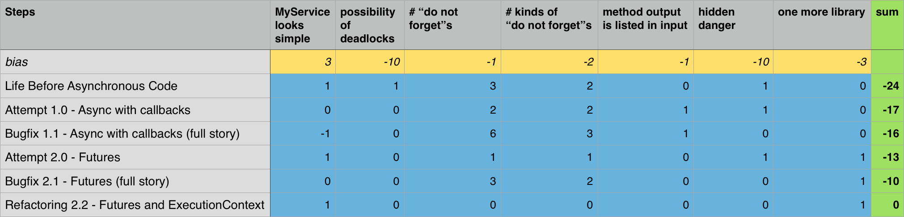

# Steps Towards Nice Asynchronous Code
This article is made to raise awareness about problems related to asynchronous code
and to provide examples solving such problems. *It also mildly advertises [AsyncNinja](http://async.ninja/) library.*

### Contents
* [Let's describe a sample problem](#lets-describe-a-sample-problem)
* [Life Before Asynchronous Code](#life-before-asynchronous-code)
* [Discussion of *"do not forget"*s](#discussion-of-do-not-forgets)
* [Goals for New Approaches](#goals-for-new-approaches)
* [Attempt 1.0 - Async with Callbacks](#attempt-10---async-with-callbacks)
* [Attempt 2.0 - Futures](#attempt-20---futures)
* [Revealing Danger](#bugfix-11---async-with-callbacks-full-story)
* [Bugfix 1.1 - Async with Callbacks (full story)](#revealing-danger)
* [Bugfix 2.1 - Futures (full story)](#bugfix-21---futures-full-story)
* [Refactoring 2.2 - Futures and ExecutionContext](#refactoring-22---futures-and-executioncontext)
* [Summary](#summary)

## Let's describe a sample problem

* `Person` is an example of a struct that contains information about person.
* `MyService` is an example of a class that serves as an entry point to model.
* `MyViewController` is an example of a class that manages UI-related instances.

We want `MyService` to provide `Person` by identifier to `MyViewController`.
`MyService` may not have this information in memory, so fetching person might involve networking, disk operations and etc.

## Life Before Asynchronous Code
Let's face synchronous variant first. I notice that oh too many projects are still using this approach.

```swift
extension MyService {
  func person(identifier: String) throws -> Person? {
    return /*fetch person from network*/
  }
}
```
Pretty straightforward. `input arguments -> output result`. Method can either
return person *(or nil if there is no such person)* or throw issue if something went wrong.
Let's take a look at usage.

```swift
extension MyViewController {
  func present(personWithID identifier: String) {

	/* do not forget to dispatch to background */
    DispatchQueue.global().async {
      do {
        let person = try self.myService.person(identifier: identifier)

        /* do not forget to dispatch to main */
        DispatchQueue.main.async {
          self.present(person: person)
        }
      } catch {

        /* do not forget to dispatch to main */
        DispatchQueue.main.async {
          self.present(error: error)
        }
      }
    }
  }
}
```
Not as beautiful as interface.

**Pros**

* `MyService` interface and implementation looks simple

**Cons**

* possibility of deadlocks in `MyService`
* "do not forget" **x3**
* *hides danger, see [Revealing Danger](#revealing-danger)*

## Discussion of *"do not forget"*s
*IMHO* each of *"do not forget"*s signalizes about poor architecture.  Even if you are
some kind of robot that avoids mistakes in 99% of cases, application with 100
of such calls will have at least one critical issue.

In more realistic conditions such calls are often nested or parallelized
that triples amount of code, complexity, and chances to make mistake.
And we did not even think of possible deadlocks in `MyService` yet!

## Goals for New Approaches
So let's try to fix issues of this approach. So new approaches have to meet goals:

* avoid possibility of deadlocks
* no "do not forget"s
* provide a reliable way of gluing UI and model together.

## Attempt 1.0 - Async with Callbacks
Since OS X 10.6 and iOS 4.0 we had closures (aka blocks).
Using closures as callback opens another dimension in making asynchronous flows.

```swift
extension MyService {
   func person(identifier: String,
               callback: @escaping (Person?, Error?) -> Void) {
    self.internalQueue.async {
      let person = /*fetch person from network*/

      /* do not forget to add call of callback here */
      callback(person, nil)
    }
  }
}
```
So we are passing callback as last argument. This interface is a little bit uglier.
It looked pure*ish*, but now it is not. Let's see how we will use this interface.

```swift
extension MyViewController {
  func present(personWithID identifier: String) {
    self.myService.person(identifier: identifier) { (person, error) in

	  /* do not forget to dispatch to main */
      DispatchQueue.main.async {

        if let error = error {
          self.present(error: error)
        } else {
          self.present(person: person)
        }

      }
    }
  }
}
```
[Cyclomatic complexity](https://en.wikipedia.org/wiki/Cyclomatic_complexity) has rised :(

*For those who see the urge to add `weaks` all over the place. Go to [Revealing Danger](#revealing-danger)*

**Pros**

* fixes 2 "do not forget"s
* possibility of deadlocks eliminated

**Cons**

* adds another kind of "do not forget"
* method output is listed as argument
* "do not forget" **x2**
* *hides danger, see [Revealing Danger](#revealing-danger)*

## Attempt 2.0 - Futures
Let's try one more approach. Idea [futures](https://en.wikipedia.org/wiki/Futures_and_promises) has involved separately. But combination with closures improves futures much.
```swift
extension MyService {
  func person(identifier: String) -> Future<Person?> {
    return future(executor: .queue(self.internalQueue)) { _ in
      return /*fetch person from network*/
    }
  }
}
```
This interface is almost as good as synchronous version. 

```swift
extension MyViewController {
  func present(personWithID identifier: String) {
    self.myService.person(identifier: identifier)

	  /* do not forget to dispatch to main */
      .onCompletion(executor: .main) {
        (personOrError) -> Void in

        switch personOrError {
        case .success(let person):
          self.present(person: person)
        case .failure(let error):
          self.present(error: error)
        }
        
    }
  }
}
```

**Pros**

* `MyService` interface and implementation looks simple
* fixes 2 "do not forget"s
* possibility of deadlocks eliminated

**Cons**

* one more library
* "do not forget" **x2**
* *hides danger, see [Revealing Danger](#revealing-danger)*

Both interface and implementation look okay. Never the less both approaches hide danger. Let's reveal it.

## Revealing Danger
Let's talk about a lifetime of `MyService` and `MyViewController`. Both of them are *active objects* that
are aware of queues, dispatches, threads and etc.
So here is the scenario:

1. User taps button "Refresh Person Info"
2. `MyViewController` calls method `self.myService.person(identifier: identifier)`
3. `MyService` starts to fetch person from network
4. There are some network issues
5. User does not want to wait for too long, so he is just closing window/popover/modal view/anything
6. The owner of `MyViewController` does not need the view controller anymore. So owner releases reference to view controller assuming that all memory allocated by `MyViewController` will be released
7. `MyViewController` is still retained by closure, so it will retain it's resources until the request completes
8. Request might not complete for a while (depending on networking configs and etc)

**As result**: memory consumption will grow, operations will continue running event if results are not required any more.
We have to fix this because memory and CPU resources are limited.

## Bugfix 1.1 - Async with Callbacks (full story)
The usual fix is involves adding `weak`s all over the place.

```swift
extension MyService {
  func person(identifier: String,
              callback: @escaping (Person?, Error?) -> Void) {
	
	/* do not forget weak self */
    self.internalQueue.async { [weak self] in
      guard let strongSelf = self else {

      	/* do not forget to add call of callback here */
        callback(nil, ModelError.serviceIsMissing)
        return
      }

      let person = /*fetch person from network*/

      /* do not forget to add call of callback here */
      callback(person, nil)
    }
  }
}

extension MyViewController {
  func present(personWithID identifier: String) {
    self.myService.person(identifier: identifier) {

      /* do not forget weak self */
      [weak self] (person, error) in

      /* do not forget to dispatch to main */
      DispatchQueue.main.async {

		/* do not forget weak self */
        [weak self] in
        guard let strongSelf = self else { return }

        if let error = error {
          strongSelf.present(error: error)
        } else {
          strongSelf.present(person: person)
        }
      }
    }
  }
}
```
This solution definitely fixes described issue but does not meet our [Goals for New Approaches](#goals-for-new-approaches).

**Pros**

* removes hidden danger
* possibility of deadlocks eliminated

**Cons**

* looks ugly
* adds another kind of "do not forget"
* method output is listed as argument
* "do not forget" **x6**

## Bugfix 2.1 - Futures (full story)
Let's apply the fix to futures-based approach. Maybe it will look better here.

```swift
extension MyService {
  func person(identifier: String) -> Future<Person?> {
    return future(executor: .queue(self.internalQueue)) {

      /* do not forget weak self */
      [weak self] _ in
      guard let strongSelf = self
        else { throw ModelError.serviceIsMissing }

      return /*fetch person from network*/
    }
  }
}

extension MyViewController {
  func present(personWithID identifier: String) {
    self.myService.person(identifier: identifier)

      /* do not forget to dispatch to main */
      .onCompletion(executor: .main) {

        /* do not forget weak self */
        [weak self] (personOrError) in
        guard let strongSelf = self else { return }

        switch personOrError {
        case .success(let person):
          strongSelf.present(person: person)
        case .failure(let error):
          strongSelf.present(error: error)
        }
        
    }
  }
}
```
Nope. It does not look better.

**Pros**

* removes hidden danger
* possibility of deadlocks eliminated

**Cons**

* one more library
* adds another kind of "do not forget"
* "do not forget" **x3**

Unfortunately, all libraries I've seen that provide futures for Swift finish here.
I had [Goals for New Approaches](#goals-for-new-approaches) to achieve, so I had to move forward.

## Refactoring 2.2 - Futures and ExecutionContext
Let's make a few assumptions before we explore this approach.

1. for `MyService`
    * `MyService` is an active object that has mutable state
    * This state is allowed to change only on serial queue owned by `MyService`
    * `MyService` owns all operations it initiates, but neither of initiated operations own `MyService`
    * `MyService` communicates with other active objects predominantly using asynchronous calls only
2. for `MyViewController`
    * `MyViewController` is an active object that has mutable state (UI)
    * This state is allowed to change only on the main queue
    * `MyViewController` owns all operations it initiates, but neither of initiated operations own `MyViewController`
    * `MyViewController` communicates with another UI related classes predominantly on the main queue 
    * `MyViewController` communicates with other active objects predominantly using asynchronous calls

So I conclude that `MyService` and `MyViewController` can be conformed to
protocol `ExecutionContext` from [AsyncNinja](http://async.ninja/) library.
That basically means that they can asynchronously execute code that influences their lifetime and internal state.

```swift
extension MyService {
  func person(identifier: String) -> Future<Person?> {
    return future(context: self) { (self) in
      return /*fetch person from network*/
    }
  }
}

extension MyViewController {
  func present(personWithID identifier: String) {
    self.myService.person(identifier: identifier)
      .onComplete(context: self) { (self, personOrError) in

        switch personOrError {
        case .success(let person):
          self.present(person: person)
        case .failure(let error):
          self.present(error: error)
        }
        
    }
  }
}
```

As you see, 99% of this complexity is hidden within [AsyncNinja](http://async.ninja/),
so there is no need to think about it each time. Just conform your active object
to `ExecutionContext` (`UIResponder`/`NSResponder` are automatically conformed to it) and use it.

**Pros**

* `MyService` interface and implementation looks simple
* removes hidden danger
* possibility of deadlocks eliminated

**Cons**

* one more library

## Summary
I love to pick between multiple variants using math. So:


Looks like my attempt to achieve all [goals](#goals-for-new-approaches) completed successfully.
I hope you'll find [AsyncNinja](http://async.ninja/) useful too.

If you want to take a deeper look at sample code or experiment yourself
visit [GitHub](https://github.com/AsyncNinja/post-steps-towards-async).
