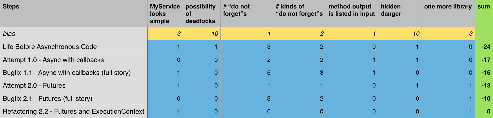

# Moving to nice asynchronous Swift code
This article raises awareness about problems related to asynchronous code
and provides examples of solving them in the context of programming on Swift 3.0.

---

### Agenda
* [Description of a sample problem](#description-of-a-sample-problem)
* [Going back to the sync coding era](#going-back-to-the-sync-coding-era)
* [Acceptance criteria for new approaches](#acceptance-criteria-for-new-approaches) 
* [Attempt 1.0. Async code with callbacks](#attempt-10-async-with-callbacks)
* [Attempt 2.0. Futures](#attempt-20-futures)
* [Revealing danger](#revealing-danger)
* [Bugfix 1.1. Async code with callbacks (a full story)](#bugfix-11-async-with-callbacks-full-story)
* [Bugfix 2.1. Futures (a full story)](#bugfix-21-futures-full-story)
* [Refactoring 2.2. Futures and ExecutionContext](#refactoring-22-futures-and-executioncontext)
* [Summary](#summary)
* [Further improvements](#further-improvements)

---

## Description of a sample problem
Here's the source data:
* `Person` is an example of a struct that contains information about the person.
* `MyService` is an example of a class that serves as an entry point to the model.
* `MyViewController` is an example of a class that manages UI-related instances.

---

`MyService` must provide `Person` to `MyViewController` in return to the request
with the corresponding identifier. It may not have the requested information in memory,
therefore fetching the person data might involve networking, disk operations, and so on.

---

## Going back to the sync coding era
I notice that many projects still use the synchronous approach. Thus, let's use it first to resolve our sample problem.

---

```swift
extension MyService {
  func person(identifier: String) throws -> Person? {
    return /*fetch the person from the network*/
  }
}
```
Seems pretty straightforward: `input arguments -> output result`. This method can either
return the person *(or nil if there is no such a person)* or throw an issue if something has gone wrong.

---

That's how it looks in use:

```swift
extension MyViewController {
  func present(personWithID identifier: String) {

    /* do not forget to dispatch to the background queue */
    DispatchQueue.global().async {
      do {
        let person = try self.myService.person(identifier: identifier)

        /* do not forget to dispatch to the main queue */
        DispatchQueue.main.async {
          self.present(person: person)
        }
      } catch {

        /* do not forget to dispatch to the main queue */
        DispatchQueue.main.async {
          self.present(error: error)
        }
      }
    }
  }
}
```

---

### About the "do not forget" comment
*IMHO*, each *"do not forget"* comment points to a poor architecture. Even if you were
a robot that could've avoid mistakes in 99% of cases, an application with 100
of these calls would have at least one critical issue.

In more realistic conditions, such calls are often nested or parallelized,
which triples the amount of code, complexity, and chances to make a mistake.
Moreover, possible deadlocks in `MyService` have yet to be discussed.

---

### About deadlocks
[Deadlocks](https://en.wikipedia.org/wiki/Deadlock) are nightmares in programming
that occur in the most unexpected places and under the most unbelievable circumstances.
Make it worse, I can tell from my own experience that 80% of deadlocks are revealed in production.

The code above is synchronous from the perspective of `MyService`.
To perform `func person(identifier: String) throws -> Person?`, we must use a lock at least two times. 
Thus, real world problems substantially increase the complexity of such cases.

There are two possible solutions: either be 100% attentive and careful
or do not use an approach that has such massive issues. As you might have guessed,
we are going to explore option #2.

---

### Summary: Synchronous approach
**Pros**

* `MyService` interface and implementation looks simple

**Cons**

* possibility of deadlocks in `MyService`
* "do not forget" **x3**
* *hidden danger, see "[Revealing danger](#revealing-danger)"*

---

## Acceptance criteria for new approaches
Now, let's try to find a new coding approach that eliminates all the issues
of the synchronous one. This approach must match the following acceptance criteria: 

* no deadlocks
* no "do not forget"s
* a reliable way of gluing UI and model together.

---

## Attempt 1.0. Async code with callbacks
We can use closures (aka blocks) as callback starting from OS X 10.6 and iOS 4.0,
which opens another dimension in making asynchronous flows.

---

```swift
extension MyService {
   func person(identifier: String,
          callback: @escaping (Person?, Error?) -> Void) {
    self.internalQueue.async {
      let person = /*fetch the person from the network*/

      /* do not forget to add a call of the callback here */
      callback(person, nil)
    }
  }
}
```
So, we are passing a callback as a last argument. 
This interface looks a little bit uglier than the previous one.
It looked more like a [pure](https://en.wikipedia.org/wiki/Pure_function) function, but now it is not.

---

However, let's check it in-use.

```swift
extension MyViewController {
  func present(personWithID identifier: String) {
    self.myService.person(identifier: identifier) {
      (person, error) in

      /* do not forget to dispatch to the main queue */
      DispatchQueue.main.async {

        if let error = error {
          self.present(error: error)
        } else {
          self.present(person: person)
        }

      }
    }
  }
}
```

---

### Summary: Attempt 1.0. Async code with callbacks

**Pros**

* one "do not forget" fixed
* no deadlocks

**Cons**

* a new kind of "do not forget" added
* method output is listed as an argument
* "do not forget" **x2**
* *hidden danger, see "[Revealing danger](#revealing-danger)"*

---

## Attempt 2.0. Futures
The idea of futures has evolved separately and it is great, especially if combined with closures.

> <[wikipedia](https://en.wikipedia.org/wiki/Futures_and_promises)> ... (futures)
> describe an object that acts as a proxy for a result that is initially unknown,
> usually because the computation of its value is yet incomplete.

This is more advanced approach than the previous one, thus make sure that you read
explanations below the code if you are unfamiliar with this idea.

---

```swift
extension MyService {
  func person(identifier: String) -> Future<Person?> {
    return future(executor: .queue(self.internalQueue)) {
      return /*fetch the person from the network*/
    }
  }
}
```

---

>
> *Brief explanation*
>
> Call of the `future(executor: ...) { ... }` function does the following:
>
> 1. Returns `Future<Person?>`
> 2. Asynchronously executes a closure using the specified *executor*. Returning a value from the closure causes future to be completed.
>
> The *executor* is an abstraction that basically describes an object that can execute a block,
> e.g. `DispatchQueue`, `NSManagedObjectContext`, and so on.
>
> So, we've dispatched execution of "fetch the person from the network" and returned the future.
>

---

```swift
extension MyViewController {
  func present(personWithID identifier: String) {
    self.myService.person(identifier: identifier)

      /* do not forget to dispatch to the main queue */
      .onComplete(executor: .main) {
        (personOrError) -> Void in

        switch personOrError {
        case .success(let person):
          self.present(person: person)
        case .failure(let error):
          self.present(error: error)
        }
        
    }
  }
}
```

---

>
> *Brief explanation*
>
> Call of `self.myService.person(identifier: identifier)` provides `Future<Person?>`.
> Line `.onComplete(executor: .main) {` specifies the reaction on completion of the future.
> `executor: main` means that the specified closure is executed using the main executor aka the main queue.
> This closure has a single argument `Fallible<Person?>`. `Fallible<T>` is almost the same as `Optional<T>` from the standard library,
> except for it has the `.failure(Error)` case instead of `.none`
> Thus, we present either a person (`Person`) or an error by switching between two available cases.
>

---

### Summary: Attempt 2.0. Futures

**Pros**

* `MyService` interface and implementation looks simple
* 2 "do not forget"s fixed
* no deadlocks

**Cons**

* one more library used
* "do not forget" **x1**
* *hidden danger, see "[Revealing danger](#revealing-danger)"*

Both interface and implementation look okay. Nevertheless, both approaches hide some danger. Let's reveal it.

---

## Revealing danger
Let's talk about a lifetime of `MyService` and `MyViewController`. Both of them are
*active objects* that are aware of queues, dispatches, threads, and so on.

---

So, here is the scenario:

1. A user clicks the "Refresh Person Info" button.
2. `MyViewController` calls the `self.myService.person(identifier: identifier)` method.
3. `MyService` starts to fetch the person from the network.
4. Some network issues occur.
5. The user does not want to wait for too long and decides to close a window/popover/modal view/anything.
6. The owner of `MyViewController` does not need the view controller anymore. So, they release a reference to view the controller assuming that the memory allocated by `MyViewController` will be released.
7. `MyViewController` is still retained by the closure, thus it retains its resources until the request is completed.
8. Completing the request might take a while (depending on the network configs, and so on).

---

**Results**: memory consumption grows, operations continue to be running even if there is no need for results anymore.

We must fix these issues because memory and CPU resources are limited.

---

## Bugfix 1.1. Async code with callbacks (a full story)
A usual fix involves adding `weak`s all over the place.

---

```swift
extension MyService {
  func person(identifier: String,
         callback: @escaping (Person?, Error?) -> Void) {

    /* do not forget the [weak self] */
    self.internalQueue.async { [weak self] in
      guard let strongSelf = self else {

        /* do not forget to add a call of the callback here */
        callback(nil, ModelError.serviceIsMissing)
        return
      }

      let person = /*fetch the person from the network*/

      /* do not forget to add a call of the callback here */
      callback(person, nil)
    }
  }
}
```

---

```swift
extension MyViewController {
  func present(personWithID identifier: String) {
    self.myService.person(identifier: identifier) {
      /* do not forget the [weak self] */
      [weak self] (person, error) in
      /* do not forget to dispatch to the main queue */
      DispatchQueue.main.async {
        /* do not forget the [weak self] */
        [weak self] in
        guard let strongSelf = self else { return }

        if let error = error {
          strongSelf.present(error: error)
        } else {
          strongSelf.present(person: person)
        }
      }
    }
  }
}
```
This solution definitely fixes the described issues but does not meet our [acceptance criteria](#acceptance-criteria-for-new-approaches).

---

### Summary: Bugfix 1.1. Async code with callbacks (a full story)

**Pros**

* hidden danger removed
* no deadlocks

**Cons**

* ugly look
* a new kind of "do not forget" added
* method output is listed as an argument
* "do not forget" **x6**

---

## Bugfix 2.1. Futures (a full story)
Now, let's apply the fix to the futures-based approach. Hopefully, it will look better here.

```swift
extension MyService {
  func person(identifier: String) -> Future<Person?> {
    return future(executor: .queue(self.internalQueue)) {

      /* do not forget the [weak self] */
      [weak self] _ in
      guard let strongSelf = self
        else { throw ModelError.serviceIsMissing }

      return /*fetch the person from the network*/
    }
  }
}
```

---

```swift
extension MyViewController {
  func present(personWithID identifier: String) {
    self.myService.person(identifier: identifier)

      /* do not forget to dispatch to the main queue */
      .onComplete(executor: .main) {

        /* do not forget the [weak self] */
        [weak self] (personOrError) in
        guard let strongSelf = self else { return }

        switch personOrError {
        case .success(let person):
          strongSelf.present(person: person)
        case .failure(let error):
          strongSelf.present(error: error)
        }
        
    }
  }
}
```
Alas, it does not look any better.

---

### Summary: Bugfix 2.1. Futures (a full story)

**Pros**

* hidden danger removed
* no deadlocks

**Cons**

* one more library added
* a new kind of "do not forget" added
* "do not forget" **x3**

---

Unfortunately, I couldn't find a Swift futures library that wouldn't have finished here.
Yet, we have [acceptance criteria](#acceptance-criteria-for-new-approaches) to match, and therefore we are moving forward.

---

## Refactoring 2.2. Futures and ExecutionContext
I've been working on a concurrency library [AsyncNinja](http://async.ninja/) to achieve these [acceptance criteria](#acceptance-criteria-for-new-approaches).
So, we'll explore solutions implemented within it. However, let's make a few assumptions before exploring this approach.

---

### Assumptions
#### `MyService`:
* `MyService` is an active object that has a mutable state
* This state can be changed in only a serial queue owned by `MyService` (as opposed to locks in the synchronous approach)
* `MyService` owns all operations it initiates, but neither of initiated operations own `MyService`
* `MyService` communicates with other active objects predominantly using asynchronous calls
    
---    
    
### Assumptions
#### `MyService`:
* `MyViewController` is an active object that has a mutable state (UI)
* This state can be changed in the main queue only (as opposed to locks in the synchronous approach)
* `MyViewController` owns all operations it initiates, but neither of initiated operations own `MyViewController`
* `MyViewController` communicates with other UI-related classes, predominantly in the main queue
* `MyViewController` communicates with other active objects, predominantly using asynchronous calls

---

Therefore, I conclude that `MyService` and `MyViewController` can be conformed to
the `ExecutionContext` protocol from the [AsyncNinja](http://async.ninja/) library.
Basically, it means that they can execute the code asynchronously, which influences their lifetime and internal state.

---

### Diving into AsyncNinja implementation
We need to discuss the details of [AsyncNinja](http://async.ninja/)'s implementation to go on with achieving our goals. So, `ExecutionContext` protocol looks like this:

```swift
public protocol ExecutionContext : class {
  var executor: Executor { get }
  func releaseOnDeinit(_ object: AnyObject)
  func notifyDeinit(_ block: @escaping () -> Void)
}
```

You must have `func releaseOnDeinit(_ object: AnyObject)` and `func notifyDeinit(_ block: @escaping () -> Void)` methods to memorize management features. However, implementing them for each `ExecutionContext` is a boilerplate code too.

---

Thus, you can just use another handy protocol that provides implementation of methods for those objects that have the `ReleasePool` instance.

*`ReleasePool` is also [AsyncNinja](http://async.ninja/)'s primitive. It retains objects until you call `func drain()`.*

```swift
public protocol ReleasePoolOwner {
  var releasePool: ReleasePool { get }
}
```

I agree that it might seem complicated, but if you use this library, there's no need to rethink/write it every time.

---

Let's take a look at the code that you actually have to write to conform to `ExecutionContext`:

```swift
class MyService : ExecutionContext, ReleasePoolOwner {
  /* own serial queue */
  let internalQueue =
    DispatchQueue(label: "my-service-queue")
  
  /* present internal queue as an executor */
  var executor: Executor {
    return .queue(self.internalQueue)
  }

  /* own release pool */
  let releasePool = ReleasePool()
    
  /* implementation */
}
```

That is it. A few additional lines that you will not forget thanks to Swift's types safety.

---

[AsyncNinja](http://async.ninja/) also provides conformance with `ExecutionContext`
to obvious active objects, e.g. `UIResponder`, `NSResponder`, `NSManagedObjectContext`, and so on.
Thus, there is no need to conform `MyViewController` to `ExecutionContext` manually.

---

### Going back to the solution
Okay, now we know all details. Let's continue with the implementation of the person fetching and presentation.

```swift
extension MyService {
  func person(identifier: String) -> Future<Person?> {
    return future(context: self) { (self) in
      return /*fetch the person from the network*/
    }
  }
}
```

---

>
> *Brief explanation*
>
> As mentioned higher, `MyService` conforms to `ExecutionContext`. This allows us to call
> `future(context: ...) { ... }` that is similar to the previously mentioned function that dispatches a closure and returns a future.
> The key difference between `future(context: ...) { ... }` and `future(executor: ...) { ... }` is that the first one is contextual.
> It means that execution of the closure is bound to the context. The closure, as the first argument, is provided with a context instance.
> Thus, boilerplate memory management is performed inside `future(context: ...) { ... }` rather than within the calling code.
>

---

```swift
extension MyViewController {
  func present(personWithID identifier: String) {
    self.myService.person(identifier: identifier)
      .onComplete(context: self) {
        (self, personOrError) in

        switch personOrError {
        case .success(let person):
          self.present(person: person)
        case .failure(let error):
          self.present(error: error)
        }
        
    }
  }
}
```

---

>
> *Brief explanation*
>
> As mentioned earlier, `MyViewController` conforms to `ExecutionContext`.
> A call of `self.myService.person(identifier: identifier)` provides `Future<Person?>`.
> The `.onComplete(context: self) {` line specifies the reaction on completion of the future.
> `context: self` means that the specified closure is executed using `ExecutionContext`'s
> executor (the main queue in this case) if the context is still alive.
> This closure has a context and `Fallible<Person?>` as arguments.
>

---

As you see, there is no need to think of memory management so often. [AsyncNinja](http://async.ninja/) encapsulates 99% of this complexity. This must help you reduce the amount of boilerplate code.
Just conform your active object to `ExecutionContext` and use futures safely.

---

### Summary: Refactoring 2.2. Futures and ExecutionContext

**Pros**

* `MyService` interface and implementation looks simple
* hidden danger removed
* no deadlocks

**Cons**

* one more library added

---

## Summary
I love to choose between multiple variants using math. So:

*[Summary as Numbers Sheet](Resources/summary.numbers.zip)*

---

Looks like our attempt to meet all [acceptance criteria](#acceptance-criteria-for-new-approaches) is successful
and I hope that you'll find [AsyncNinja](http://async.ninja/) useful too.

If you want to take a deeper look at a sample code or try it by yourself,
visit [GitHub](https://github.com/AsyncNinja/article-moving-to-nice-asynchronous-swift-code).

---

## Further improvements
Further improvements are possible. This code will look even better with language support
(something like `async`, `yield`, etc.), but we are not there yet.

---

Scala for example has syntactic sugar for futures. Here is an example of combining futures in scala:

```scala
val futureA = Future{...}
val futureB = Future{...}
val futureC = Future{...}

val futureABC = for{
  resultA <- futureA
  resultB <- futureB
  resultC <- futureC
} yield (resultA, resultB, resultC)
```

---

Now I personally do not see any advantage here because you can do the following using [AsyncNinja](http://async.ninja/):

```swift
let futureA: Future<ResultA> = /* ... */
let futureB: Future<ResultB> = /* ... */
let futureC: Future<ResultC> = /* ... */

let futureABC = zip(futureA, futureB, futureC)
```

---

I thank everyone who reached the end of this doc. You are awesome!

Also, I want to give a shout-out to [MacPaw](https://macpaw.com) for helping me with editing and implementing these ideas.
We will use these findings in the next update of [Gemini](https://macpaw.com/gemini), so stay tuned.
